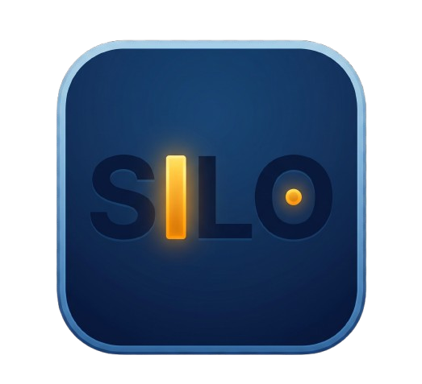

# Privacy Policy for Silo Launcher

**Effective Date:** August 7, 2026  
**Last Updated:** August 7, 2026  

Silo Launcher ("Silo", "we", "our", or "us") is dedicated to protecting your privacy. This Privacy Policy explains how Silo Launcher handles your information when you use our Android application.

Our fundamental design philosophy is **on-device privacy first**. Silo Launcher is built as a minimal, context-shifting Android launcher that processes your data locally on your device without collecting, transmitting, or selling your personal information.

---

## 1. Information We Process & How It Is Used

Silo Launcher operates entirely on your Android device. App capabilities are used strictly to deliver core launcher functionality:

### A. App Drawer & Launching
- **Purpose:** Accesses your installed app list locally to organize app silos and launch apps.
- **Privacy Assurance:** Installed app lists stay on your phone and are **never** logged, saved remotely, or sent to external servers.

### B. Smart Context Triggers (Location & Bluetooth)
- **Purpose:** Optional features allow automatic mode switching (e.g. Work vs Home focus profiles) based on connected Bluetooth devices or real-time location.
- **Privacy Assurance:** Location and Bluetooth signals are processed in real-time on-device to trigger mode shifts. Your location history is **never tracked, recorded, or saved**.

### C. Focus Mode & Do Not Disturb
- **Purpose:** Adjusts Do Not Disturb (DND) settings automatically when you switch focus profiles.
- **Privacy Assurance:** Silo **never** reads, intercepts, or stores the content of your notifications or messages.

### D. Home Screen Widgets
- **Purpose:** Allows placing Android home screen widgets on your desktop.
- **Privacy Assurance:** Silo acts strictly as a host frame and does not inspect or collect data inside third-party widgets.

---

## 2. On-Device Storage & Retention

- **Local Storage Only:** All launcher rules, shortcuts, and focus settings remain securely saved inside your device's private app storage.
- **No Cloud Syncing:** Silo Launcher does not sync your setup, personal data, or usage metrics to cloud databases.

---

## 3. Security & Anti-Tamper Verification

- **Infrastructure Verification:** Silo Launcher includes standard Google security verification tools to confirm authentic, untampered app installations.
- **No Identity Tracking:** Security checks do not track individual user identities, browsing behavior, or personal data.
- **No Ad Networks:** Silo Launcher contains zero advertising SDKs, zero analytics tracking frames, and zero data brokers.

---

## 4. Zero Data Selling

We do **not** sell, rent, trade, or monetize your personal data under any circumstances. Your data is never shared with advertisers or data brokers.

---

## 5. Your Rights & Data Deletion

You have complete control over your launcher data:
- You can clear all stored preferences anytime under **Android Settings > Apps > Silo > Storage > Clear Storage**.
- Uninstalling Silo Launcher immediately and permanently removes all saved data from your phone.

---

## 6. Children's Privacy

Silo Launcher is compliant with COPPA and GDPR regulations. Because no personal data is collected or transmitted, Silo is safe for all age groups.

---

## 7. Contact Us

If you have questions or feedback concerning Silo Launcher's privacy design, please visit our official GitHub repository:

- **GitHub Repository:** [https://github.com/saifsahil3/silo-launcher-android](https://github.com/saifsahil3/silo-launcher-android)
